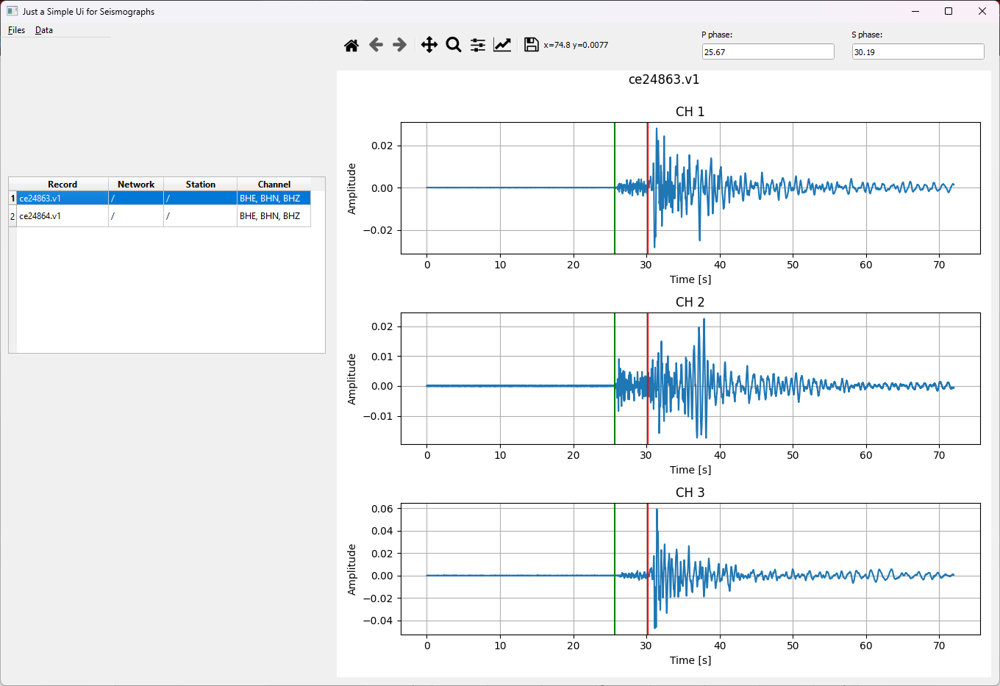

# JSUS-Just a Simple UI for Seismologists

Just a Simple UI for Seismologists (JSUS) is a user interface that helps seismologists quickly inspect and visualize seismograph and accelerograph data. At the moment it is possible to read all formats that can be read using [ObsPy](https://docs.obspy.org/) package as well as files with the .v1 extension. In JSUS users can pick P and S earthquake phases and visualize the Fourier amplitude spectrum and spectrogram.

## Installing JSUS

Argos works with Python 3.7 and higher.

To run JSUS first clone repository:

    git clone https://github.com/JakovStanislav/JSUS
    
Then run the setup.py file:

    python setup.py install
    
Finally, run the main:

    python main.py
    
## Using JSUS
The JSUS main window consists of a table (left side) that contains information on all loaded records. On the right side of the main window, there are three figures, one for each of the record´s components. Above the figures, there is a navigation toolbar that is used for navigating through the plotted data set. Also, on the right of the navigation toolbar, there are two fields that show the selected times of the **P** and **S** phases.

### Loading data
Loading records into JSUS works by going to Files → Read batch, this will open a window where a user needs to select a folder from which he wants to read records. JSUS will automatically find all suitable records inside that folder and inside all subfolders of the selected folder.

