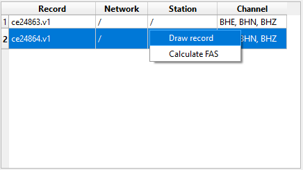
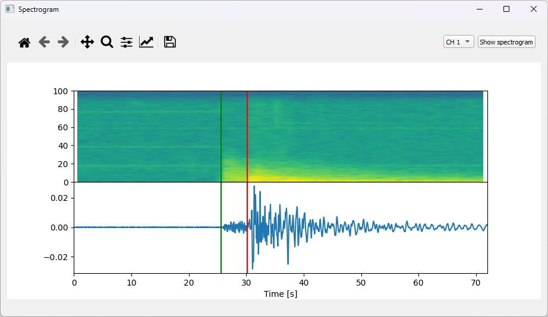

# JSUS-Just a Simple UI for Seismologists

**J**ust a **S**imple **U**I for **S**eismologists (JSUS) is a user interface that helps seismologists quickly inspect and visualize seismograph and accelerograph data. At the moment it is possible to read all formats that can be read using [ObsPy](https://docs.obspy.org/) package as well as files with the .v1 extension. In JSUS users can pick **P** and **S** earthquake phases and visualize the Fourier amplitude spectrum (FAS) and spectrogram.

## Installing JSUS

JSUS works with Python 3.7 and higher.

To run JSUS first clone repository:

    git clone https://github.com/JakovStanislav/JSUS
    
Then run the setup.py file:

    python setup.py install
    
Finally, run the main:

    python main.py
    
## Using JSUS
The JSUS main window consists of a table (left side) that contains information on all loaded records. On the right side of the main window, there are three figures, one for each of the record´s components. Above the figures, there is a navigation toolbar that is used for navigating through the plotted data set. Also, on the right of the navigation toolbar, there are two fields that show the selected times of the **P** and **S** phases.

    

### Loading data
Loading records into JSUS works by going to `Files → Read batch`, this will open a window where a user needs to select a folder from which he wants to read records. JSUS will automatically find all suitable records inside that folder and inside all subfolders of the selected folder.

    

### Plotting data
To plot records press the right mouse button over the row of the record you want to draw and then click `Draw record`.

    

To plot the FAS of the selected record you need to click `Calculate FAS`.

    

### FAS window
In the FAS window, the Fourier amplitude spectrum of existent channels will be displayed.

    

Here it is possible to change the scale of both axes (**X** and **Y**) by pressing the right mouse button over the figures. Also, it is possible to turn on/off a grid by pressing `Toggle grid`.

    

Finally from the FAS window, it is possible to show the spectrogram by pressing `Show spectrogram`.

#### Spectrogram window
In the spectrogram window, the user can select which channels spectrogram will be drawn by selecting a channel and pressing `Show spectrogram`.

    

It is possible to change the colormap of the spectrogram by right-clicking over the spectrogram figure and pressing `Change colormap`. This will open a new window where it is possible to select colormap. Choosing a colormap is done by first selecting a category from which the colormap will be selected. When the category is selected, an image with all available colormaps from that category will appear. Now from the drop-down menu user can select the colormap that he wants. 

    

